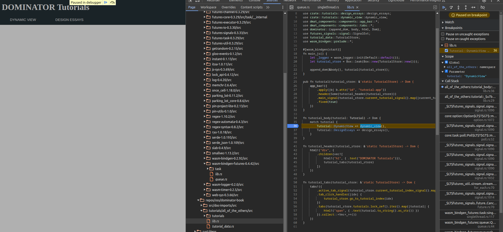
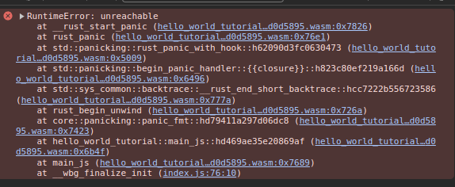
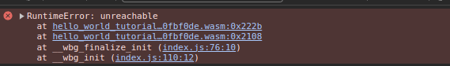
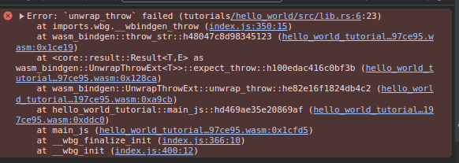

# Logging and Debugging

By default, you will not be able to view your source code directly in the browser as you would with javascript.
However, the browser supports DWARF debugging symbols, which are generated by the rust compiler.

You will also need to use Chrome with the [C++ DWARF Chrome extension](https://chromewebstore.google.com/detail/cc++-devtools-support-dwa/pdcpmagijalfljmkmjngeonclgbbannb) extension.

## Enable debug builds

When using rollup, we need to enable debug builds.
This is done via a parameter to the rust plugin, configured in the rollup configuration file.

```js
plugins: [
    rust({
        serverPath: "js/",
        debug: true,
        cargoArgs: ["--config", "profile.dev.debug=true"],
        wasmBindgenArgs: ["--debug", "--keep-debug"]
    })
]
```

If you are using `trunk`, you need the following line in your index.html:

```
<link data-trunk rel="rust" href="Cargo.toml" data-keep-debug>
```

With the DWARF plugin installed and debug symbols enabled, we can set breakpoints and step through our code as we are used to from other environments:



When debug builds are enabled, we get a much more meaningful error message from the browser:



As opposed to the (very) unhelpful release build message:




## Use unwrap_throw

Another good practice is to use `unwrap_throw()` and `expect_throw()` as opposed to `unwrap()` and `expect()`.
The `_throw()` counterpart will create a nicer JS exception than the generic runtime error caused by a panic.

This improved exception contains source information that greatly improves the debugging experience:



## Logging

The `log` crate provides a fairly ubiquitous interface for various logging tasks in the rust ecosystem.
The `wasm-logger` crate gives us the option to use this from the browser as well (targeting the console, as one might expect).

Simply add the `log` and `wasm-logger` crates as dependencies, and initialize logging from your main function:

```rust,no_run,noplayground
wasm_logger::init(wasm_logger::Config::default());
```

You can now use the various logging macros from `log` as you are used to!